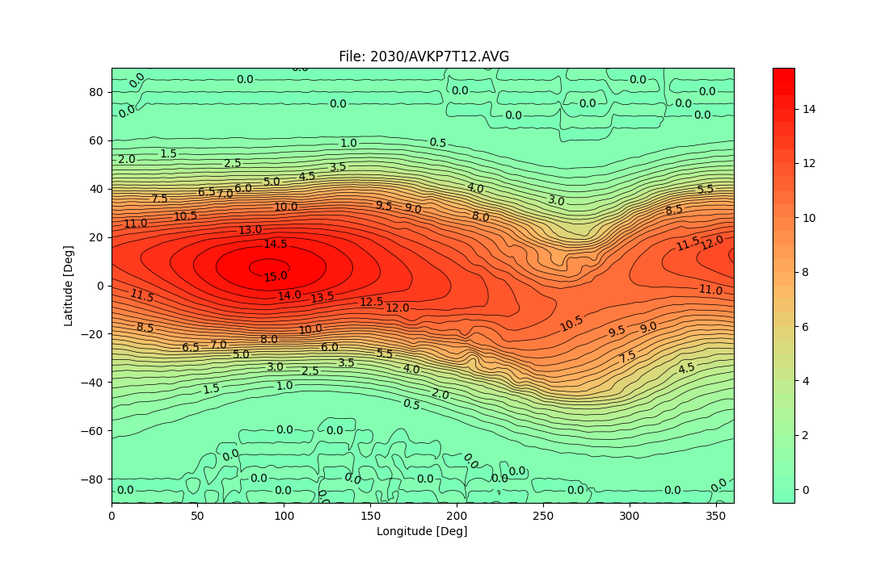

# MSM_maps
Pre-calculated rigidity cut-off maps for MSM and PyMSM

Example of Global Cutoff at 450km Altitude, for Kp7 at 2030.0, UT12

They are generated using the [MAGNETOCOSMICS](https://essr.esa.int/project/cosmics-charged-particles-in-planetary-environments) with IGRF14 and the TS89c with Boberg extension. The Kp > 5 and Dst relationship is 
* Kp = 6: kp5 with Dst = -150 nT
* Kp = 7: kp5 with Dst = -200 nT
* .. Kp+1 -> Dst -50 nT step size ..
* ...

## Codes and models use these maps

- [PyMSM](https://github.com/drflei/PyMSM)
- [MSM](https://spitfire.estec.esa.int/trac/ESHIEM/browser/msm)
- NoM
- IRENE
- [MAIRE & MAIRE+](http://maire.uk/maire/)

## File descriptions
* proc_maps.py - script for processing the MAGNETOCOSMICS .out files to .AVG map files, using the premap tool
* proc_map - sh script version of proce_maps.py. Not used now.
* premap.for - Fortran code converting .out file to .AVG file. It use the  [IRBEM](https://github.com/drflei/IRBEM.git) library for calculating the L paramter. 
* plotmaps.py - untility code for plotting the maps
* 1955, ...,2030 - subfolders of the precalculated regidity cutoff maps at the epoch. 